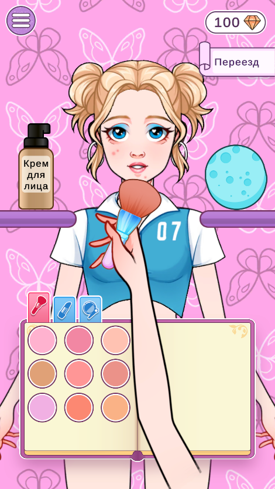
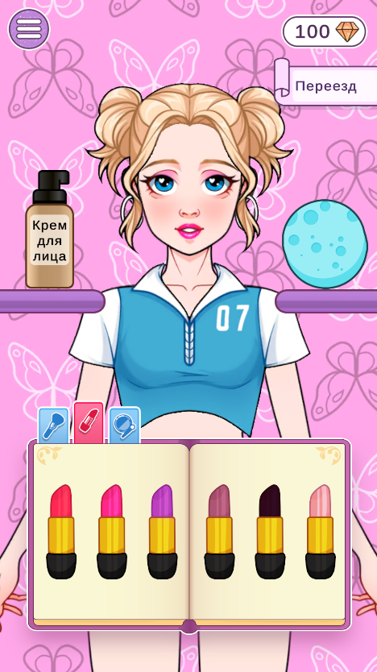
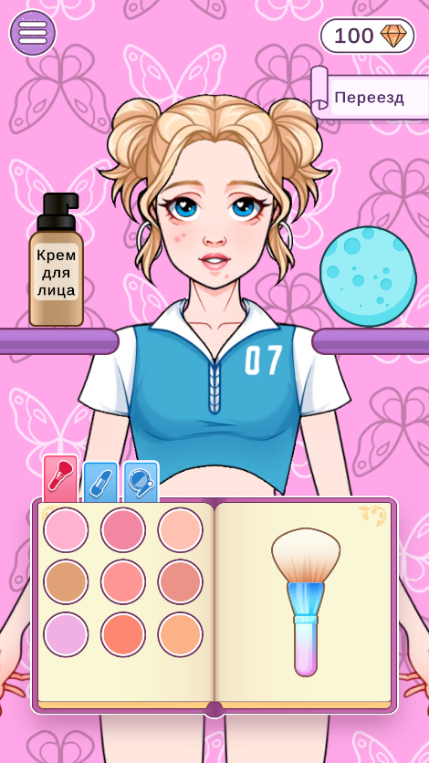

# Dress-Up-DIY

2D-проект на Unity с экраном механики макияжа: управление рукой перетаскиванием, нанесение крема, румян, теней и помады, сброс макияжа спонжем.

  

## Используемые пакеты и плагины

- **Universal Render Pipeline (URP)** — `com.unity.render-pipelines.universal`
- **Unity Input System** — `com.unity.inputsystem` (action map `Assets/_Project/Scripts/InputSystem/`)
- **DOTween** — анимации последовательностей руки
- **UniTask** — асинхронные сценарии без лишних аллокаций
- **TextMeshPro / uGUI** — при необходимости для UI

## Геймплей (кратко)

| Действие | Поведение |
|----------|-----------|
| **Крем** | Взятие → рука у “стартового” положения → drag к лицу → при отпускании **в зоне лица** нанесение и смена визуала (проблемная кожа → чистая), затем возврат крема |
| **Румяна** | Взятие кисти → выбор цвета (погружение в палитру, окрашивание кончика) → удержание у груди → drag → нанесение в зоне лица → возврат |
| **Тени** | Аналогично румянам, нанесение на оба глаза по сценарию |
| **Помада** | Взятие помады → удержание → drag → нанесение по контуру губ → возврат |
| **Спонж** | Тап по зоне спонжа — сброс макияжа на лице без участительных анимаций сценария |

Отпускание пальца **вне** зоны лица во время drag не завершает нанесение (рука остаётся в контроле игрока до корректного релиза или смены состояния).

## Архитектура проекта

Основная логика лежит в `Assets/_Project/Scripts/Gameplay/`:

- **Bootstrap** — сборка зависимостей сценария (`MakeupGameplayBootstrap`) и стартовое состояние.
- **Interaction** — обработка тапов по книге/спонжу/крему и пошаговых стадий (`MakeupTapFlow`, `MakeupStageInputFlow`).
- **Input** — снимок указателя за кадр, хит-тест `Physics2D.OverlapPointNonAlloc`, разбор попаданий по палитре/вкладкам.
- **Tool flow** — сценарии инструментов (крем, румяна, помада, тени) и возврат активного инструмента.
- **Hand** — перемещение руки, сглаживание drag, DOTween-жесты.
- **State** — стадии `MakeupProcessStageType`, визуальное состояние инструментов.
- **Config** — `ScriptableObject` с настройками (`*Settings`) и сериализуемые ссылки на объекты сцены (`*SceneReferences`).
- **View** — MonoBehaviour-представления книги, вкладок, палитры, состояния лица.

Карта действий ввода: `Assets/_Project/Scripts/InputSystem/InputSystem_Actions.inputactions`.